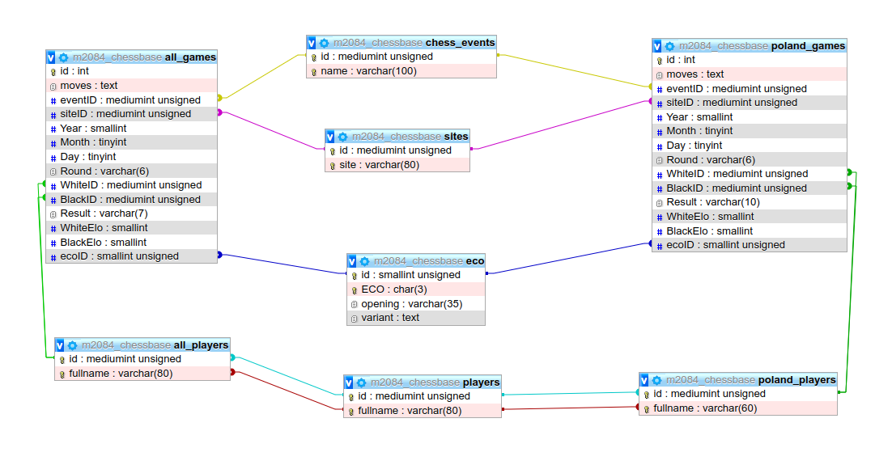

<style>
    table, th, td {
        border: .1em solid #000;
    }    
    table{
        border-collapse: collapse;
    }
    th{
        background-color: #e5e5e5;
    }
    th, td {
        padding: 0.2em;
    }
</style>
# Struktura

## baza danych



### Tabele:

#### all_games
| Kolumna | Typ | Null | Ustawienia domyślne| Odsyłacze do |
| ------- | --- | ---- | -------------------| --------------- |
|id (Podstawowy)|	int	|Nie			|	|
|moves|	text|	Tak|	NULL	|		|
|eventID|	mediumint|	Nie|	|	chess_events -> id	|	
|siteID|	mediumint|	Nie	|	|sites -> id|		
|Year|	smallint|	Nie	|			|
|Month|	tinyint	|Tak	|NULL	|		|
|Day|	tinyint|	Tak	|NULL	|		|
|Round|	varchar(6)|	Tak	|NULL	|		|
|WhiteID|	mediumint|	Nie|	|	all_players -> id|		
|BlackID|	mediumint|	Nie	|	|all_players -> id|		
|Result|	varchar(7)|	Tak|	NULL	|		|
|WhiteElo|	smallint|	Tak	|NULL	|	|	
|BlackElo|	smallint|	Tak	|NULL	|	|	
|ecoID|	smallint|	Nie	|	|eco -> id	|

##### Indeksy
|Nazwa klucza	|Typ	|Jednoznaczny	|Spakowany	|Kolumna	|Moc	|Metoda porównywania napisów	|Null|
|-------------- |------ | ------------- |---------- | --------- | ----- | ------------------------------ | -- |
|PRIMARY	|BTREE	|Tak	|Nie	|id	|10891801	|A	|Nie|	
|WhiteID	|BTREE	|Nie	|Nie	|WhiteID	|1046412	|A	|Nie	|
|BlackID	|BTREE	|Nie	|Nie	|BlackID	|1107381	|A	|Nie	|
|eventID	|BTREE	|Nie	|Nie	|eventID	|583884	|A	|Nie|	
|siteID	|BTREE	|Nie	|Nie	|siteID	|303594	|A	|Nie	|
|Year	|BTREE	|Nie	|Nie	|Year	|5899	|A	|Nie	|
|ecoID	|BTREE	|Nie	|Nie	|ecoID	|6148	|A	|Nie	|
|Result	|BTREE	|Nie	|Nie	|Result	|32	|A	|Tak	|

#### all_players
| Kolumna | Typ | Null | Ustawienia domyślne| Odsyłacze do |
| ------- | --- | ---- | -------------------| --------------- |
|id (Podstawowy)	|mediumint	|Nie		|players -> id|		
|fullname	|varchar(80)	|Nie		|players -> fullname|	

##### Indeksy
|Nazwa klucza	|Typ	|Jednoznaczny	|Spakowany	|Kolumna	|Moc	|Metoda porównywania napisów	|Null|
|-------------- |------ | ------------- |---------- | --------- | ----- | ------------------------------ | -- |
|PRIMARY	|BTREE	|Tak	|Nie	|id	|484362	|A	|Nie|	
|fullname	|BTREE	|Tak	|Nie	|fullname	|484362	|A	|Nie|	
|all_players	|BTREE |	Nie	|Nie	|id|	484362|	A	|Nie	|
|               |      |     |       |fullname|	484362|	A|	Nie|
|fullname_2	|FULLTEXT	|Nie	|Nie	|fullname	|484362	|	|Nie|	

#### chess_events
| Kolumna | Typ | Null | 
| ------- | --- | ---- | 
|id (Podstawowy)	|mediumint	|Nie	|		
|name	|varchar(100)	|Nie|	

##### Indeksy
|Nazwa klucza	|Typ	|Jednoznaczny	|Spakowany	|Kolumna	|Moc	|Metoda porównywania napisów	|Null|
|-------------- |------ | ------------- |---------- | --------- | ----- | ------------------------------ | -- |
|PRIMARY	|BTREE	|Tak	|Nie	|id	|188112	|A	|Nie|	
|name	|BTREE	|Tak	|Nie	|fullname	|181251	|A	|Nie|	
|name_2	|FULLTEXT	|Nie	|Nie	|fullname	|188112	|	|Nie|	

#### eco
| Kolumna | Typ | Null | Ustawienia domyślne |
| ------- | --- | ---- | ------------------- |
|id (Podstawowy)	|smallint	|Nie		|		
|ECO	|char(3)	|Nie		|		|
|opening|	varchar(35)|	Tak	|NULL|			
|variant	|text	|Tak	|NULL|	

##### Indeksy
|Nazwa klucza	|Typ	|Jednoznaczny	|Spakowany	|Kolumna	|Moc	|Metoda porównywania napisów	|Null|
|-------------- |------ | ------------- |---------- | --------- | ----- | ------------------------------ | -- |
|PRIMARY	|BTREE	|Tak	|Nie	|id	|500	|A	|Nie|	
|ECO	|BTREE	|Tak	|Nie	|ECO	|500	|A	|Nie|	
|ECO_2	|BTREE	|Nie	|Nie	|ECO	|500	|A	|Nie|	

#### eco
| Kolumna | Typ | Null | Ustawienia domyślne |
| ------- | --- | ---- | ------------------- |
|fideid (Podstawowy)	|int	|Nie|	|			
|name	|varchar(90)	|Tak	|NULL|			
|country	|char(3)	|Tak	|NULL|			
|sex	|char(3)	|Tak	|NULL	|		
|title	|varchar(3)	|Tak	|NULL	|		
|w_title	|varchar(3)	|Tak	|NULL|			
|o_title	|varchar(9)	|Tak	|NULL|			
|foa_title	|varchar(3)	|Tak	|NULL|			
|rating	|smallint	|Tak	|NULL	|		
|games	|smallint	|Tak	|NULL	|		
|k	|tinyint	|Tak	|NULL		|	
|rapid_rating	|smallint	|Tak	|NULL|			
|rapid_games	|smallint	|Tak	|NULL|			
|rapid_k	|tinyint	|Tak	|NULL	|		
|blitz_rating	|smallint	|Tak	|NULL|			
|blitz_games	|smallint	|Tak	|NULL|			
|blitz_k	|tinyint	|Tak	|NULL	|		
|birthday	|mediumint	|Tak	|NULL	|		
|flag	|varchar(2)	|Tak	|NULL		|

##### Indeksy
|Nazwa klucza	|Typ	|Jednoznaczny	|Spakowany	|Kolumna	|Moc	|Metoda porównywania napisów	|Null|
|-------------- |------ | ------------- |---------- | --------- | ----- | ------------------------------ | -- |
|PRIMARY	|BTREE	|Tak	|Nie	|fideid	|1258560	|A	|Nie|	
|name	|FULLTEXT	|Nie	|Nie	|name	|1258560	|	|Tak|	

#### players
| Kolumna | Typ | Null |  
| ------- | --- | ---- | 
|id (Podstawowy)	|mediumint	|Nie|		
|fullname	|varchar(80)	|Nie|

##### Indeksy
|Nazwa klucza	|Typ	|Jednoznaczny	|Spakowany	|Kolumna	|Moc	|Metoda porównywania napisów	|Null|
|-------------- |------ | ------------- |---------- | --------- | ----- | ------------------------------ | -- |
|PRIMARY	|BTREE	|Tak	|Nie	|id	|1638362	|A	|Nie|	
|fullname	|BTREE	|Tak	|Nie	|fullname	|1523240	|A	|Nie|	
|idx_players_relation	|BTREE |	Nie	|Nie	|id|	1638155|	A	|Nie	|
|               |      |     |       |fullname|	1634356|	A|	Nie|
|fullname_2	|BTREE	|Nie	|Nie	|fullname	|1638362	|	A|Nie|	
|fullname_3	|FULLTEXT	|Nie	|Nie	|fullname	|1638362	|	|Nie|	


#### poland_games
| Kolumna | Typ | Null | Ustawienia domyślne| Odsyłacze do |
| ------- | --- | ---- | -------------------| --------------- |
|id (Podstawowy)|	int	|Nie			|	|
|moves|	text|	Tak|	NULL	|		|
|eventID|	mediumint|	Nie|	|	chess_events -> id	|	
|siteID|	mediumint|	Nie	|	|sites -> id|		
|Year|	smallint|	Nie	|			|
|Month|	tinyint	|Tak	|NULL	|		|
|Day|	tinyint|	Tak	|NULL	|		|
|Round|	varchar(6)|	Tak	|NULL	|		|
|WhiteID|	mediumint|	Nie|	|	poland_players -> id|		
|BlackID|	mediumint|	Nie	|	|poland_players -> id|		
|Result|	varchar(7)|	Tak|	NULL	|		|
|WhiteElo|	smallint|	Tak	|NULL	|	|	
|BlackElo|	smallint|	Tak	|NULL	|	|	
|ecoID|	smallint|	Nie	|	|eco -> id	|

##### Indeksy
|Nazwa klucza	|Typ	|Jednoznaczny	|Spakowany	|Kolumna	|Moc	|Metoda porównywania napisów	|Null|
|-------------- |------ | ------------- |---------- | --------- | ----- | ------------------------------ | -- |
|PRIMARY	|BTREE	|Tak	|Nie	|id	|647473	|A	|Nie|	
|Year	|BTREE	|Nie	|Nie	|Year	|156	|A	|Nie	|
|WhiteID	|BTREE	|Nie	|Nie	|WhiteID	|49161	|A	|Nie	|
|BlackID	|BTREE	|Nie	|Nie	|BlackID	|42598	|A	|Nie	|
|eventID	|BTREE	|Nie	|Nie	|eventID	|13556	|A	|Nie|	
|siteID	|BTREE	|Nie	|Nie	|siteID	|6204	|A	|Nie	|
|ecoID	|BTREE	|Nie	|Nie	|ecoID	|429	|A	|Nie	|


#### poland_players
| Kolumna | Typ | Null | Ustawienia domyślne| Odsyłacze do |
| ------- | --- | ---- | -------------------| --------------- |
|id (Podstawowy)	|mediumint	|Nie		|players -> id|		
|fullname	|varchar(80)	|Nie		|players -> fullname|	

##### Indeksy
|Nazwa klucza	|Typ	|Jednoznaczny	|Spakowany	|Kolumna	|Moc	|Metoda porównywania napisów	|Null|
|-------------- |------ | ------------- |---------- | --------- | ----- | ------------------------------ | -- |
|PRIMARY	|BTREE	|Tak	|Nie	|id	|47765	|A	|Nie|	
|fullname	|BTREE	|Tak	|Nie	|fullname	|47765	|A	|Nie|	
|pol_players	|BTREE |	Nie	|Nie	|id|	47396	|	A	|Nie	|
|               |      |     |       |fullname|	47765|	A|	Nie|
|fullname_2	|FULLTEXT	|Nie	|Nie	|fullname	|47765	|	|Nie|	

#### sites
| Kolumna | Typ | Null | 
| ------- | --- | ---- | 
|id (Podstawowy)	|mediumint	|Nie	|		
|site	|varchar(80)	|Nie|	

##### Indeksy
|Nazwa klucza	|Typ	|Jednoznaczny	|Spakowany	|Kolumna	|Moc	|Metoda porównywania napisów	|Null|
|-------------- |------ | ------------- |---------- | --------- | ----- | ------------------------------ | -- |
|PRIMARY	|BTREE	|Tak	|Nie	|id	|88910	|A	|Nie|	
|sites	|BTREE	|Tak	|Nie	|site	|88604	|A	|Nie|	
|site	|BTREE	|Nie	|Nie	|site	|88910	|A	|Nie|	


## strona

/

* **composer.json** - plik composera
* **composer.lock** - plik composera
* **content.php** - kontener z zawartością strony, wymaga left_content i manifest
* **footer.php** - stopka `<footer>`
* **header.php** - nagłówek `<head>`
* **index.php** - plik domyślny, wymaga header, menu, content, footer
* **left_content.php** - zawiera przydatne linki
* **LICENSE** - licencja
* **manifest.php** - manifest
* **menu.php** - menu nawigacyjne 
* **API/** - API, patrz docs/API.md
* **contact/** - formularz kontaktowy
  * **content.php** - formularz, przekierowuje do send
  * **index.php** - strona domyślna, wymaga content
  * **send** - wysyła wiadomość na maila
* **css/** - arkusze stylów
  * **chessicons.css** - arkusz do wyświetlania partii (dla game/)
  * **player_data.css** - arkusz dla player_data/
  * **reset.css** - reset css-a
  * **search.css** - arkusz wyszukiwarki partii
  * **style.css** - domyślny arkusz stylów
* **docs/** - dokumentacja
  * **API.md** - opis API
  * **struktura.md** - ten plik
  * **struktura.png** - grafika z relacją bazy danych
* **game/** - przeglądarka gier
  * **chessicons/**
    * **\[bw\]\[bknpqr\].svg** - grafiki bierek
    * **license.txt** - plik z linkiem do strony autora grafik
  * **content.php** - kontener na zawartość
  * **index.php** - plik domyślny, ustawia osobny nagłówek, wymaga menu,content,footer
* **game_raw/** - partia w formacie [PGN](http://www.saremba.de/chessgml/standards/pgn/pgn-complete.htm)
  * **content.php** - zawartość strony, wymaga login_data
  * **index.php** - plik domyślny, wymaga content
  * **login_data.php** - plik z danymi do łączenia z bazą
  trzeba ustawić zmienne:
        *  `$host = "localhost"` - host;
        *  `$user = "user"` - użytkownik;
        *  `$password = "password"` - hasło;
        *  `$base = "base"` - baza;
        *  `$table = "games"` - tabela z grami;
        *  `$players_table = "players"` - tamela z zawodnikami;
        *  `$events_table = "events"` - tabela z turniejami;
        *  `$sites_table = "sites"` - tabela z miejscami;
* **license/** - licencja
  * **index.php** - plik domyślny, wymaga header, menu, content, footer
  * **content.php** - faktyczna licencja
* **markodwn** - parser markdown
    * **MarkodowParser.php** - opakowanie klasy
    * **parse.php** - skrypt do parsowania srton markdown
        * metoda: GET
        * ```
          {
              url: url - adres
          }
          ```
* **player_data/** - dane o zawodniku
  * **content** - kontener na dane
  * **index.php** - plik domyślny
* **players/** - wyszukiwarka graczy
  * **content.php** - formularz do wyszukiwania i skrypt do wyszukiwania w bazie
  * **index.php** - plik domyślny
  * **login_data.php** - plik z danymi do łączenia z bazą danych
  trzeba ustawić zmienne:
    *  `$host = "localhost"` - host;
      *  `$user = "user"` - użytkownik;
      *  `$password = "password"` - hasło;
      *  `$base = "base"` - baza;
      *  `$table1 = "used_players"` - tabela z użytymi graczami;
      *  `$table2 = "players"` - tabela ze wszystkimi graczami;
* **rodo**/ - informacja dla fanów RODO
  * **content.php** -informacja
  * **index.php** - plik domyślny
* **script/** - katalog ze skryptami javascripta 
  * **game_display_functions.js** - funkcje do wyświetlania gier
  * **game.js** - główny skrypt game/
  * **pgnv.js** - [zewnętrzna bibliteka](https://github.com/mliebelt/PgnViewerJS/) 
  * **player_data_functions.js** - funkcje do danych zawodnika
  * **player_data.js** - główny skrypt player_data/
  * **search_functions.js** - funckje do wyszukiwania gier 
  * **search.js** - główny skrypt search/
* **search/** - wyszukiwarka partii
  * **content.php** - kontener na zawartość
  * **index.php** - plik domyślny
* **vendor/** - katalog z bibliotekami